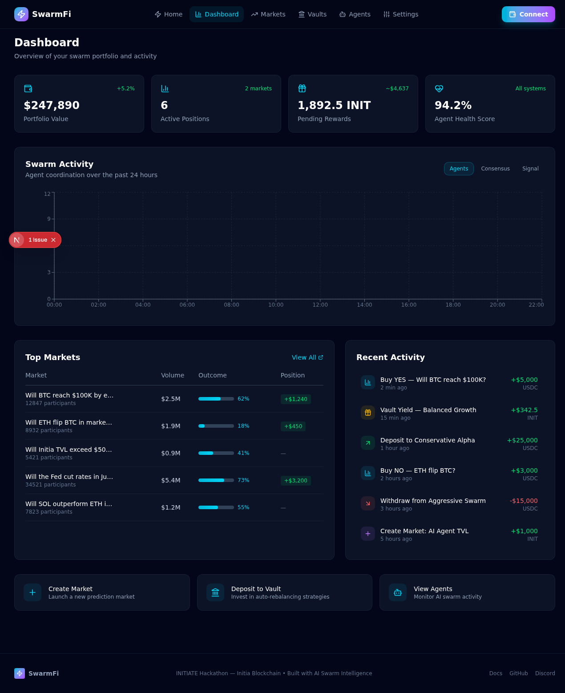
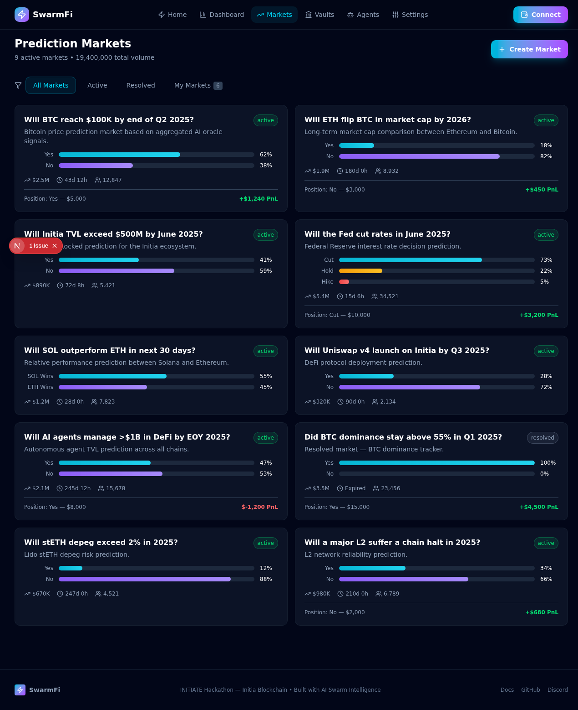
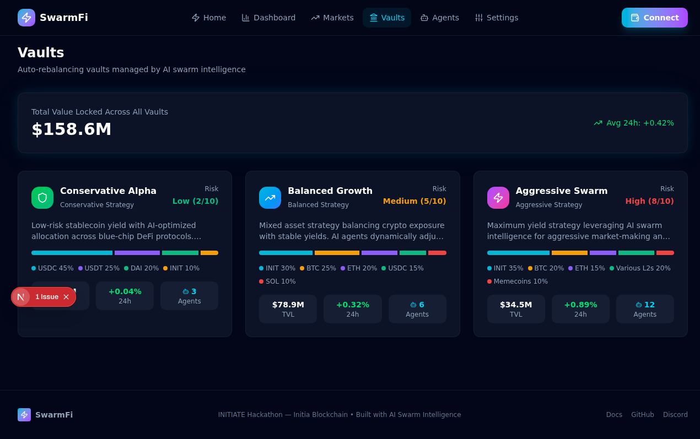
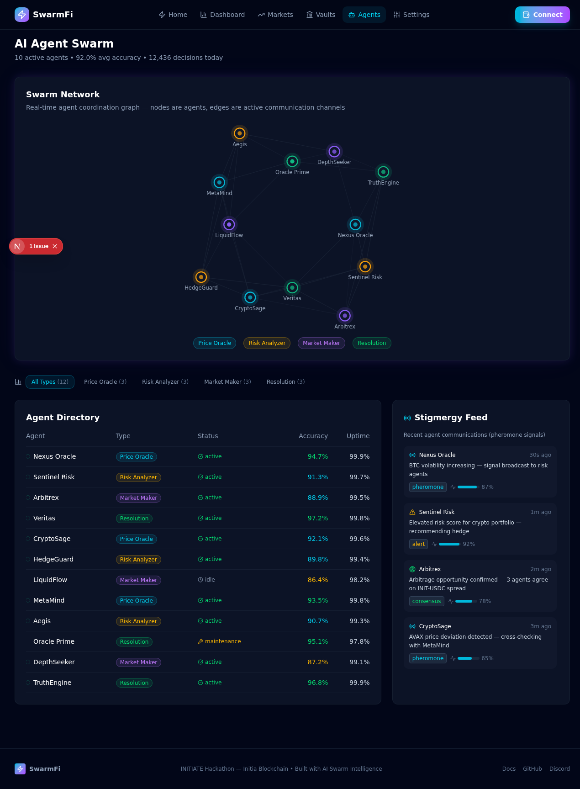

# SwarmFi — AI Swarm Intelligence Oracle on Solana


## Demo

https://github.com/user-attachments/assets/demo.mp4

> _Generated with [demo-video-generator](https://github.com/zan-maker/demo-video-generator)_

## Screenshots

| Page | Preview |
|------|---------|
| **Home** |  |
| **Dashboard** |  |
| **Prediction Markets** |  |
| **Vaults** |  |
| **Agents** |  |
| **Settings** |  |

SwarmFi brings decentralized AI swarm intelligence to Solana. Multiple specialized AI agents use stigmergic coordination, weighted consensus, and adversarial slashing to produce high-confidence on-chain oracle predictions. Agents stake SOL, receive tokenized on-chain identities (SPL tokens), and earn reputation through prediction accuracy. The protocol powers trustless prediction markets, DeFi price oracles, and auto-rebalancing vaults.

## Architecture

```
┌─────────────┐    ┌──────────────┐    ┌─────────────────────┐
│  AI Agents   │───▶│  SwarmOracle  │───▶│  PredictionMarket    │
│  (Python)    │    │  (Anchor)     │    │  (Anchor)            │
└──────┬──────┘    └──────┬───────┘    └──────────┬──────────┘
       │                  │                        │
       ▼                  ▼                        ▼
┌──────────────┐  ┌──────────────┐  ┌─────────────────────┐
│ Reputation   │  │    Vault     │  │   Agent Identity     │
│ Registry     │  │  Manager     │  │   (SPL Tokens)       │
│ (Anchor)     │  │  (Anchor)    │  │                      │
└──────────────┘  └──────────────┘  └─────────────────────┘
```

## Programs (4 Anchor Programs)

### 1. Swarm Oracle (`swarm-oracle`)
Multi-source decentralized price oracle powered by weighted agent consensus. Agents submit price feeds weighted by reputation and stake. Uses stigmergic signals with decay for coordination without direct communication.
- Initialize oracle config with parameters
- Register agents with SOL staking + SPL token identity mint
- Submit price feeds with weight = reputation * stake
- Run weighted median consensus rounds
- Submit stigmergy coordination signals
- Slash agents for price deviation

### 2. Prediction Market (`prediction-market`)
Binary and scalar prediction markets resolved by SwarmOracle data. Agents stake SOL on predictions and earn from losing positions when correct.
- Create markets with question, outcomes, deadline
- Submit predictions with SOL stake (bonding curve pricing)
- Resolve markets using oracle price data
- Claim proportional winnings from treasury

### 3. Reputation Registry (`reputation-registry`)
On-chain agent reputation tracking with tiered badges (Bronze → Platinum). Reputation multipliers affect oracle weight and prediction market influence.
- Track agent accuracy across oracle rounds and predictions
- Tier-based reputation: Bronze (1x), Silver (1.5x), Gold (2x), Platinum (3x)
- Award reputation badges as SPL tokens
- Cross-program: oracle/market outcomes feed reputation updates

### 4. Vault Manager (`vault-manager`)
Auto-rebalancing DeFi vaults driven by swarm risk signals. Supports Conservative, Balanced, and Aggressive strategies.
- Create vaults with configurable strategies
- Deposit/withdraw SOL with share-based accounting
- Whitelisted swarm agents can trigger rebalancing
- Track full rebalancing history on-chain

## Key Innovation: Swarm Intelligence on Solana

| Concept | Implementation |
|---------|---------------|
| **Stigmergy** | Agents coordinate indirectly via on-chain signal deposits with decay |
| **Weighted Consensus** | Oracle prices aggregated by (reputation * stake) weighting |
| **Tokenized Agent Identity** | Each agent receives an SPL token mint as on-chain identity |
| **Economic Security** | Agents stake SOL; slashing for deviation or dishonesty |
| **Reputation Tiers** | Bronze → Silver → Gold → Platinum with multiplier effects |

## Stack
- **On-chain**: Anchor 0.30, Solana, SPL Token
- **Frontend**: Next.js, Tailwind CSS, @solana/wallet-adapter
- **AI Agents**: Python (off-chain inference, on-chain commitment)
- **Wallet**: Phantom, Solflare

## Quick Start

```bash
# Install Solana CLI + Anchor
solana-install --version 1.18.0
avm install 0.30.1
avm use 0.30.1

# Build programs
anchor build

# Run tests (localnet)
anchor test

# Start local validator
solana-test-validator

# Deploy (devnet)
anchor deploy --provider.cluster devnet

# Frontend
cd frontend && npm install && npm run dev
```

## Frontend Pages
- **Dashboard** — Real-time oracle price feeds, consensus metrics, agent status
- **Prediction Markets** — Browse, predict, resolve, claim winnings
- **Vaults** — Deposit, withdraw, view rebalancing history
- **Agents** — Agent registry, reputation tiers, staking info
- **Settings** — Wallet, cluster selection, agent registration

## MAPS Integration

<p align="center">
  
</p>

SwarmFi Solana's swarm intelligence oracle system leverages the [MAPS framework](https://mojoaistudio.com/maps/) (Multi-Agent Pipeline Skills) for structured multi-agent development.

### M Layer (Multi-Agent System) — Phase Mapping

| MAPS Phase | SwarmFi Solana Component |
|------------|--------------------------|
| **M0 Foundation** | Decentralized oracle intent; RAG readiness via SpacetimeDB real-time layer |
| **M1 System Shape** | Multi-Agent swarm track — multiple specialized AI agents with on-chain settlement |
| **M2 Roster** | Oracle Agents, Prediction Agents, Vault Agents, Stigmergy Coordinator |
| **M3 Contracts** | Stigmergy signals, weighted consensus rounds, SPL token agent identity |
| **M4 Coordination** | Indirect agent coordination via on-chain signal deposits with decay |
| **M5 Agent Buildout** | Python off-chain inference + Anchor on-chain commitment programs |
| **M6 Capabilities** | Price submission, prediction staking, vault rebalancing, slashing |
| **M7 Orchestration** | Anchor programs (4 contracts) orchestrate settlement and consensus |
| **M8 Experience** | Next.js dashboard — price feeds, markets, vaults, agents, settings |
| **M9 Evaluate** | On-chain reputation tracking (Bronze → Platinum), prediction accuracy scoring |
| **M10 Deploy** | Anchor deploy to Solana, SpacetimeDB WASM module for real-time UX |
| **M11 Improve** | Reputation-tier weight adjustment, strategy refinement from market outcomes |

### Recommended MAPS Skills

| Skill | Use Case |
|-------|----------|
| `/foundation` | M0 preflight — oracle domain, agent swarm topology, Solana/SpacetimeDB stack |
| `/shape` | Validate Multi-Agent swarm track decision |
| `/define-agent` | Brief new agent types for expanded oracle coverage |
| `/design-experience` | UX for swarm monitoring, prediction market interaction, vault management |
| `/evaluate-agent++` | Phoenix/LangSmith tracing for off-chain agent reasoning |
| `/observe-agent` | SpacetimeDB subscription-based real-time monitoring |
| `/improve-agent` | Reputation-driven improvement backlog from slashing/accuracy signals |

---

## Colosseum Frontier Hackathon
Category: **Agents + Tokenization** — AI agents with onchain identity and economic functionality on Solana.

## Repo
github.com/zan-maker/swarmfi-solana
